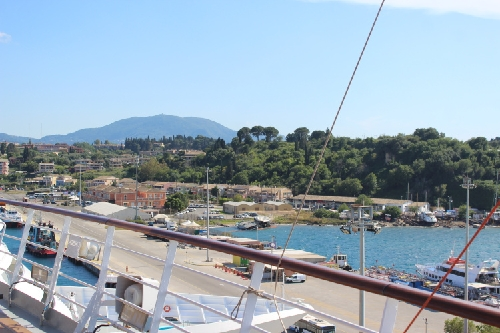

# **Mit dem Rollstuhl aufs Meer** – Unsere Reise mit der Costa Deliziosa

## **Kapitel 1:** Warum wir diese Reise gemacht haben

Es war nicht die erste Kreuzfahrt für meine Freundin und mich, aber die erste für meine Mutter. Sie fühlte sich richtig an. Nicht nur, weil diesmal alles klappte. Sondern weil wir wussten, worauf es wirklich ankommt.

Meine Mutter hatte eine große Operation hinter sich, meine Partnerin ist auf den Rollstuhl angewiesen – und wir alle hatten uns eine Auszeit verdient. Frische Seeluft, neue Eindrücke, ein bisschen Freiheit, die man nicht planen kann.

## **Kapitel 2:** Anreise & Einschiffung

Statt direkt vom Zug aufs Schiff zu hetzen, haben wir bewusst eine Übernachtung eingeplant – als Zeitpuffer, zum Durchatmen, und um den Reisestress vor dem Einschiffen gering zu halten. Unsere Wahl fiel auf das Meininger Hotel in Mestre, das sich als echter Glücksgriff erwies: Als das Personal den Rollstuhl sah, bekamen wir sofort und ohne Aufpreis ein barrierefreies Zimmer. Als eine Mitarbeiterin an der Rezeption zur Musik tanzte war der Urlaub eingeleitet. So begann der Urlaub mit einem Lächeln.

Der Shuttle von Shuttle Direct holte uns am nächsten Morgen pünktlich ab. Die Koffer hatten wir per BagExpress vorausgeschickt. Anfangs waren wir nervös, doch der Kundendienst beruhigte uns schnell. Auf dem Schiff tauchten die Koffer wie versprochen pünktlich auf.

Dank der Anmeldung eines Rollstuhls wurden wir bevorzugt eingeschifft. Kein Gedränge, keine Hektik. Die Crew war aufmerksam und herzlich.

## **Kapitel 3:** Alltag an Bord

Unsere Suite war geräumig, der Balkon schnell unser Lieblingsort. Während ich die Seeluft genoss, suchte meine Mutter mit dem Fernglas nach Inseln. Die Dusche war ebenerdig und mit allem ausgestattet, was man für eine kleine Spa-Auszeit braucht.

Mike vom Kabinenpertsonal hatte schnell raus, dass ich abends gerne ein "Schlafbierchen" auf dem Balkon trank. Manchmal hinterließ er mir eines in der Minibar. Als ich den Rollator meiner Mutter als Stuhl zweckentfremdete, brachte er kurzerhand einen dritten Balkonstuhl.

Wir mieden das Elite-Restaurant und zogen das Buffet vor. Besonders praktisch: Wenn meine Freundin mit dem Rollstuhl allein unterwegs war, half sofort jemand beim Tablett. Wer auf Luxus steht, sollte sich das Elite-Retsaurant nicht entgehen lassen. Wir bevorzugten aber die Abwechslung und das wuselige Ambiente am Buffet.

Die Pizzeria bot hervorragende Pizza, und an der Aperol-Spritz-Bar am Heck ließ es sich gut entspannen. Dank unseres "My Drinks Plus"-Pakets wurde uns nie etwas berechnet – vermutlich auch ein Vorteil der Suite-Buchung, inklusive kostenloser Minibar.

## **Kapitel 4:** Unsere Häfen

#### Bari

Wir verließen das Schiff nicht, beobachteten aber das Hafenleben vom Balkon. Ein ruhiger, vielversprechender Auftakt.

#### Kotor

Die spektakuläre Einfahrt in die Bucht von Kotor war atemberaubend. Die Altstadt mit den roten Dächern und der orthodoxen Kirche war vom Schiff aus gut zu erkennen.

#### Korfu

Die Insel wirkte sonnig und freundlich. Vom Deck aus beobachteten wir das bunte Treiben, ein Tragflügelboot rauschte vorbei.

#### Katakolon

Ein kleiner, entspannter Hafen. Wir blieben an Bord, genossen aber die Ruhe und den Blick auf die griechische Küste.

#### Dubrovnik

Ich ging allein an Land, besuchte eine Apotheke und einen Supermarkt. Alles war gut zu Fuß erreichbar und barrierearm. Die Strasse, gleich hinter dem Terminal ist schnell zu Fuß zu erreichen und mit kleinen Strassencafés geschmückt.

#### Zadar

Ursprünglich war Split geplant, aber wegen Wind ging es nach Zadar. Die Decks wurden gesperrt, Stühle rutschten auf dem Balkon herum. Aber niemand von uns hatte Angst. Wir wurden eher ein bisschen in den Schlaf geschaukelt. Als Highlight tauchten plötzlich drei Delfine auf. Kein Foto, aber ein perfekter Moment.

#### Venedig (Rückkehr)

Ah, Venedig. Die Ankunft hatte etwas Wehmütiges. Wir blieben noch einen Moment an Deck und ließen die Reise Revue passieren. Natürlich gönnten wir uns noch eine Nacht im Meininger Hotel.

#### Rückfahrt nach München

Im Zug nach Hause schauten wir aus dem Fenster, müde, aber zufrieden. 

## Fazit: Eine Reise voller gemeinsamer Entdeckungen

Wir haben es geschafft – als Familie, als Team. Es war nicht immer planbar, aber erstaunlich viel war machbar. Die gute Vorbereitung hat sich gelohnt. Und manchmal auch das Vertrauen darauf, dass sich Dinge einfach fügen.

**Warum dieser Bericht?**
Wir möchten mit diesem Bericht Mut machen: für Menschen, die mit Mobilitätseinschränkingen leben, oder Angehörige begleiten.
Die Planung war nicht immer einfach - aber das Meer war jede Mühe wert.
Vielleicht hilft dir unser Erfahrungsbericht, deine eigene Reise ein bisschen leichter zu gestalten.

Tipp zur Barrierefreiheit

Die Zugstrecke München–Venedig Mestre war erfreulich barrierearm: In beiden Bahnhöfen konnte man nahezu ebenerdig in den Zug einsteigen. Sollte der Mobilitätsservice einmal ausfallen, reicht meist ein kräftiger Rollstuhlschieber.

Nicht verpassen!

Ein echter Gänsehautmoment: Wenn die Piloten im Hafen bei voller Fahrt vom kleinen Lotsenboot auf das Kreuzfahrtschiff übersetzen. Wer die Augen offen hält, kann mit etwas Glück dieses Kunststück beobachten.

### Ein persönliches Wort zum Schluss

Ich danke, der Physiotherapeutin, die so herzlich meine Freundin betreut. Ohne sie wäre ich nicht auf die Idee gekommen einen 
Reisebericht zu verfassen und zu veröffentlichen.

<h2>FAQ zur Reiseplanung</h2>

  
<strong>Wie funktioniert der Gepäcktransport mit Bag Express?</strong>

  
Bag Express lässt sich bequem online buchen. Das Gepäck wird per UPS direkt zu Hause abgeholt und am Ende der Reise wieder bis zur Haustür geliefert.

  
<strong>Wie haben wir die Zugreise und Einstiegshilfen organisiert?</strong>

  
Die Sitzplätze im Railjet haben wir direkt über die ÖBB gebucht. Die Einstiegshilfe in München wurde über die Deutsche Bahn organisiert, die Einstiegshilfe in Venedig über <em>Salablu</em>.

  
<strong>Wie meldet man einen Rollstuhl oder Rollator bei Costa an?</strong>

  
Unbedingt frühzeitig direkt bei Costa oder über das Reisebüro die Formulare zur Anmeldung anfordern und einreichen – das erleichtert alles Weitere enorm.

  
<strong>Wie kommt man am besten zum Kreuzfahrtterminal in Venedig?</strong>

  
Wir empfehlen den Start vom Bahnhof Mestre. Von dort gibt es barrierefreie Transfers (z. B. über Shuttle Direct), die einen direkt bis zum Terminal bringen. Die Anreise von Santa Lucia aus ist für Rollstuhlfahrer komplizierter, da man den Canal Grande überqueren müsste.

  
<strong>Wie lief unser Transfer mit Shuttle Direct ab?</strong>

  
Der Fahrer holte uns am Meininger Hotel in Mestre ab und brachte uns direkt zum richtigen Terminal. Bei der Buchung konnten wir Schiff und Route angeben – so wurden mögliche Verspätungen gleich mit eingeplant. Bezahlt wurde im Voraus, und der unterschriebene Voucher genügte.

<strong>Benötige ich für Medikamente einen Nachweis?</strong>

Die meisten gängigen Medikamente wie **Ibuprofen**, **Paracetamol**, **ASS** oder auch **Novaminsulfon (z. B. Novalgin)** kannst du problemlos mitnehmen – sie gelten nicht als betäubungsmittelpflichtig und benötigen **keinen ärztlichen Nachweis**, solange sie in haushaltsüblichen Mengen mitgeführt werden.

Anders sieht es bei bestimmten Medikamenten aus, etwa:

- **Opiaten** wie **Morphin, Tilidin, Oxycodon**
- **Beruhigungsmitteln** wie **Tavor (Lorazepam)** oder **Diazepam**
- **ADHS-Medikamenten** wie **Methylphenidat (Ritalin)**

Für diese kann ein **ärztliches Attest** oder ein spezielles **BtM-Formular** nötig sein – insbesondere bei Reisen **außerhalb des Schengenraums**. Wer solche Medikamente braucht, sollte sich **vorher genau über die Einreisebestimmungen der angefahrenen Länder informieren**.

Wir selbst hatten einen einfachen Medikamentenplan dabei, wurden aber nie danach gefragt.

<strong>Sollte ich so eine Reise überhaupt wagen?</strong>

Diese Frage ist absolut berechtigt – vor allem, wenn man gesundheitlich eingeschränkt ist oder eine Reise mit betreuungsbedürftigen Angehörigen plant.  

Unsere klare Antwort lautet: **Ja – wenn es irgendwie möglich ist, dann lohnt es sich!**  
Natürlich braucht es etwas mehr Planung, etwas mehr Geduld, und manchmal muss man kreativ werden. Aber gerade deshalb ist so eine Reise auch etwas ganz Besonderes.

Wir selbst waren überrascht, **wie gut vieles funktioniert hat** – mit etwas Vorbereitung und der richtigen Portion Humor. Und wir wurden oft freundlich unterstützt, sei es von Hotelpersonal, Bahnmitarbeitern oder dem Personal an Bord.

Vielleicht klappt nicht alles perfekt. Aber:  
> **Was bleibt, sind die Erlebnisse – nicht die Herausforderungen.**

Wenn dich die Reise reizt: Trau dich! Vielleicht ist dein Weg ein anderer, aber er kann trotzdem wunderschön sein.

[Zur Foto-Galerie](galerie.html)
